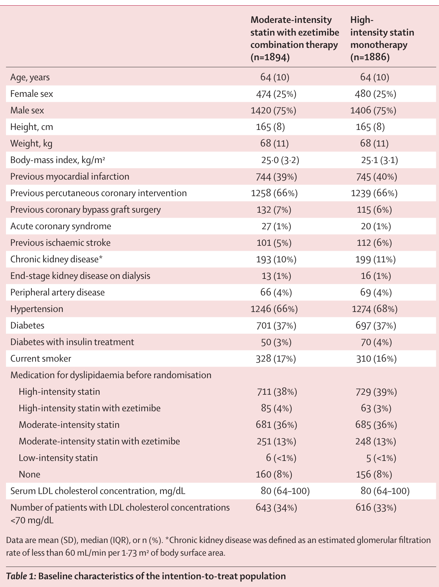
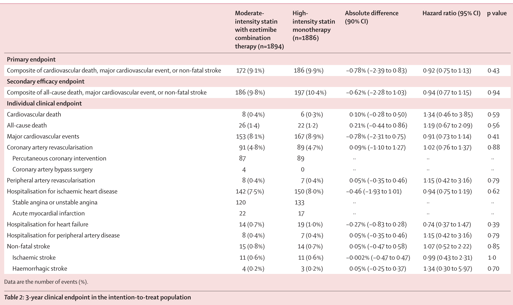
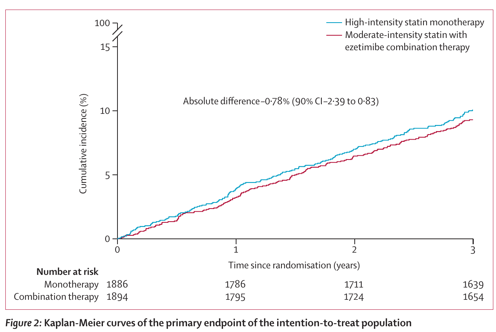
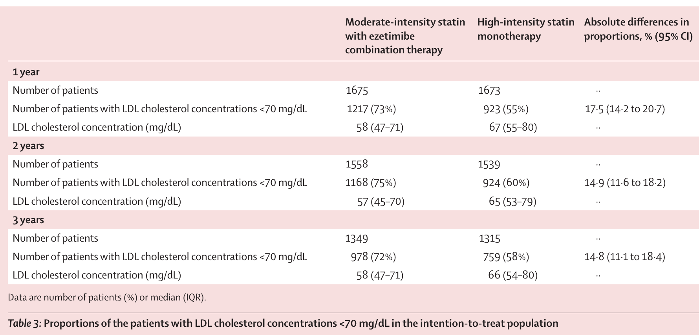
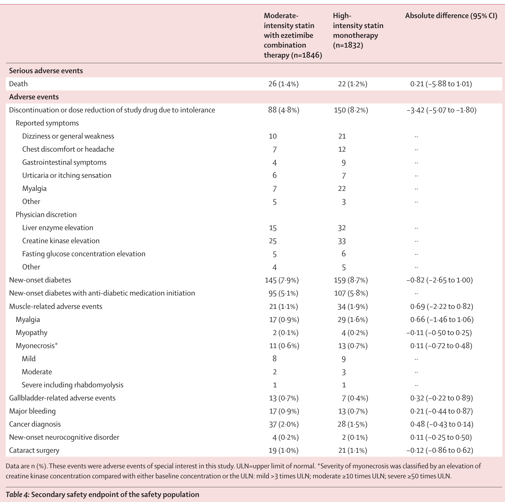
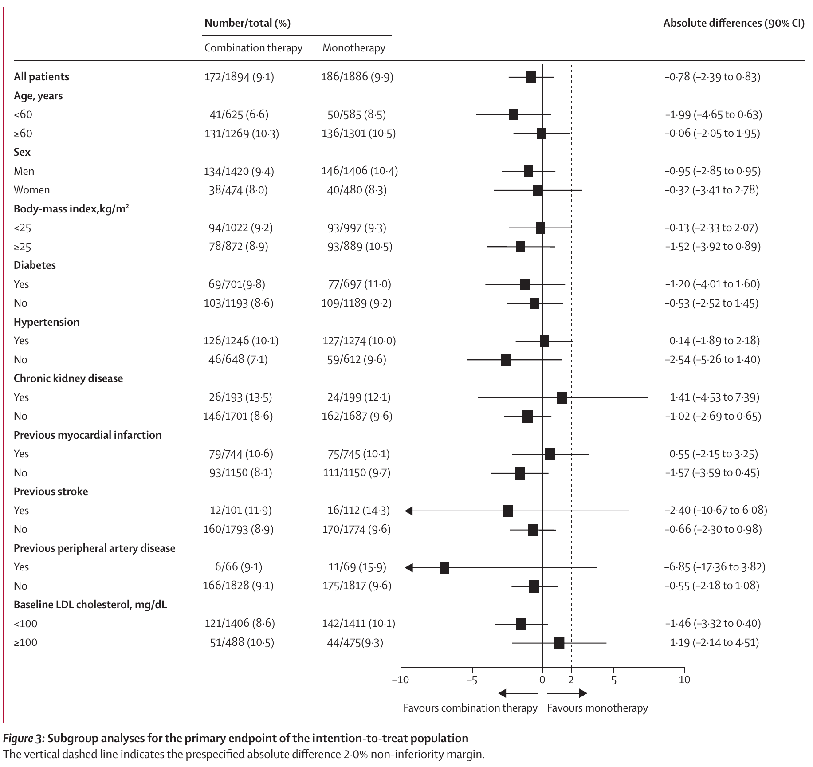
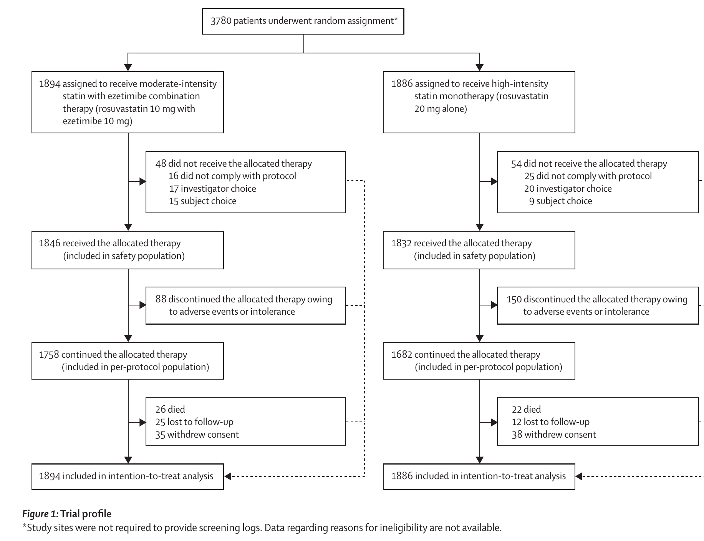

## Glossary
-   **ASCVD 환자**: 동맥경화성 심혈관질환이 이미 있는 환자를 말함. 보통 LDL 수치가 매우 높음.   
-   **LDL** : 간에서 조직 말단, 혈관으로 운반되는 콜레스테롤.   
-   **Statin** : 스타틴. 간 내 콜레스테롤 합성을 억제하여 혈중 LDL 농도를 낮추는 약.   
-   **Ezetimibe** : 에제티미브. 소장의 콜레스트롤 흡수를 억제하여 혈중 LDL 농도를 낮추는 약.

## Introduction
- ASCVD 환자에게 적용하는 치료약의 **효과성**과 **안전성**을 측정함.    
- **효과성**: primary Endpoint 발생하는 환자가 적을수록, LDL<70mg을 만족하는 환자가 많을수록 **효과성이 높다**고 판단.   
- **안전성**: 약제 불내성으로 인한 약 복용 중단하는 환자가 적을수록 **안전성이 높다**고 판단.

## Background
::: {.panel-tabset}
### 기존 연구
- **lower-intensity** statin + ezetimibe와 **high-intensity** statin monotherapy 비교.
- 장기 임상결과로 직접 비교한 무작위 임상실험이 없었음. 주로 LDL 수치 같은 surrogate outcome을 비교.

### RACING Trial
- **high-intensity** statin monotherapy vs **moderate-intensity** statin with ezetimibe combination therapy 비교. 
- long-term, randomized, controlled trial
- **이 연구를 통한 시사점**: LDL 수치를 낮추는 방법이 꼭 statin 용량 증가일 필요는 없다는 주장을 뒷받침함. 
고강도 statin에 대한 부작용(근육통, 간효소 상승, 당 조절 문제)을 겪는 환자에게 실용적인 대안을 제시함. 
:::

# Method

## Study design and Treatment Allocation {.scrollable}
- **Randomized, open-label, non-inferiority trial**: 
  - 환자를 무작위로 배정, 환자와 의사 모두 치료군을 알고 있었으며, 병합요법이 단독요법보다 임상적으로 뒤떨어지지 않는지 평가함.

- **Multi-center, investigator-initiated**: 
  - 한국 26개 병원에서 진행된 연구, 연구자 주도 임상실험. 여러 기관이 참여했기 때문에 일반화 가능성 높음.

- **ASCVD Population**: 
  - 죽상경화성 심혈관질환이 있는 환자.
  - 심근경색, 급성관상동맥증후군, 재혈관화, 허혈성 뇌졸중, 말초동맥질환 병력이 있는 고위험군.
  - LDL을 강하게 낮춰야 하는 대상. 목표: LDL 수치<70mg/dL
  
- **1:1 Web-response permuted-block Randomization**:
  - 웹기반 시스템을 통해 두 치료군에 1:1 배정됨.
  - Permuted-block Randomization을 통해 두 군의 환자수가 균형 있게 유지되도록 함.
  
- **Mixed block sizes of 4 or 6**: 
  - 항상 같은 block size를 쓰면 다음 배정을 예측할 가능성이 생기므로, 이를 배제하고자 mixed block을 사용함.

- **Stratified by baseline LDL cholesterol and diabetes**
  - LDL cholesterol<100mg/dL (LDL 수치 높은 고위험군)
  - Diabetes
  - 두 변수는 심혈관 위험과 LDL 조절에 영향을 줄 수 있으므로 양쪽 군에 균형 있게 배치함.
- **3-year follow-up**
  - 약 용량 3년 동안 유지 강하게 권고.
  - 3년동안 전반적 건강 상태/ 근육관련 증상/ 약 복용 여부/ endpoint occurrence/ 약 부작용/ LDL cholesterol 수치 추적함.
  
- 

## 실험군
:::: {.columns}

::: {.column width="50%"}
**단독요법군**:  
- Rosuvastatin 20mg 1일 1회

:::

::: {.column width="50%"}
**병합요법군**:  
- Rosuvastatin 10mg + Ezetimibe 10mg 1일 1회
:::

::::

# Outcomes {.scrollable}

::: {.panel-tabset}
### Primary Composite Endpoint
- 이 연구의 핵심 outcome.
- 3년 동안 **심혈관 사망, 주요 심혈관 사건, 비치명적 뇌졸증** 하나라도 발생하면, primary endpoint가 발생한 것으로 판단함.

### Secondary Endpoint 
- **Secondary Efficacy Endpoint**:
  - 치료 효과를 추가로 확인하기 위한 outcome. 
  - primary endpoint의 개별 구성요소의 발생률.
  - 1년, 2년, 3년에 LDL<70mg/dL 달성률.
  - LDL cholesterol <55 mg/dL 달성률은 post-hoc analysis로 평가함.  

- **Safety Endpoint**:
  - 치료가 얼마나 안전하고 지속 가능한지를 본 outcome.
  - 약제 불내성으로 인한 약물 중단 또는 감량을 확인함. 
  - 새로 발생한 당뇨/근육 관련 이상반응/ 간 관련 이상반응을 관찰함.
:::

# Statistical Analysis and Results

## Statistical Analysis Overview {#statistical-analysis-overview}
::: {.panel-tabset}
### Primary objective
- 중증도 statin + ezetimibe 병합요법이 고강도 statin 단독요법보다 primary composite endpoints에 대해 열등하지 않은가? 
- non-inferiority test 비열등성 검정

### Secondary objective
-  중증도 statin + ezetimibe 병합요법이 고강도 statin 단독요법보다 LDL 조절 효과가 더 높은가? 
- LDL 조절 효과에 대해 우월성 검정

### Sample size
-   IMPROVE-IT trial의 6-year primary endpoint event rate를 참고함.
-   RACING의 예상 3-year event rate는 13% vs 14%로 설정함.
-   One-sided alpha 5%, power 80%, noninferiority margin 2.0%p를 적용함.
-   15% loss to follow-up을 고려해 총 3780명을 목표로 함.

### Analysis population
-   Primary analysis는 intention-to-treat population에서 시행함.
-   Per-protocol population으로 sensitivity analysis를 시행함.
-   Safety outcomes는 safety population에서 분석함.
-   Prespecified subgroup analysis로 결과의 일관성을 확인함.
:::

## Primary Objective and Results {#primary-objective-main .scrollable}

-   Primary endpoint에 대해 **non-inferiority**를 검정함.
-   병합요법이 고강도 statin 단독요법보다 3년 primary endpoint에서 임상적으로 뒤떨어지지 않는지 평가함.
-  CI의 upper bound가 비열등성 margin보다 작으면 비열등성 입증.
-   이 분석은 사건이 언제 발생했는지까지 반영한 [**Time-to event outcome analysis**](#time-to-event-outcome-analysis)로 분석함.
- Results:  
  -병합요법: 172/1894명, 9.1%
  - 고강도 스타틴 단독: 186/1886명, 9.9%
  - 절대위험차: -0.78%
  - 90% CI: -2.39% to 0.83%
- 결과 해석: 90% CI upper bound(0.83%)가 non-inferiority margin (2.0%)보다 작기 때문에,  병행요법이 단독요법에 비열등하다고 결론을 낼 수 있다.   
- 

## Time-to event outcome analysis {#time-to-event-outcome-analysis .scrollable}
- 단순히 event 발생 여부만 보는 것이 아니라, **언제 event가 발생했는지**까지 고려함.  

- K-M curve: 시간에 따라 사건이 얼마나 누적되는지 보여주는 그림.  
- Log-rank test: 두 K-M curve가 전체 추적기간 동안 통계적으로 다른지 검정.  
- Cox Regresssion: 두 군의 event 발생 속도를 hazard ratio, HR로 비교.  HR이 1이면 비슷하고, 1보다 작으면 치료군의 event 위험이 낮은 방향.  
- Results:  RACING에서는 병합요법과 고강도 스타틴 단독요법의 K-M curve가 비슷했고,   Cox HR은 0.92로 1에 가까웠음.  
그래서 두 군의 3년 심혈관 사건 발생 양상은 전반적으로 비슷하다고 해석함.  
- K-M Curve  

[Primary Objective로 돌아가기](#primary-objective-main)

## Secondary Objective and Results {.scrollable}
- Primary objective가 유의하게 충족되면 secondary objective으로 넘어감.
- LDL cholesterol을 70 mg/dL 미만으로 낮추는 목표 달성률을 비교하는 **우월성**을 검정함.
- LDL 수치<70 mg/dL 달성률을 1년, 2년, 3년에 평가함.
- Results: 병합요법군이 고강도 statin 단독 요법군보다 모든 시점에서 LDL 목표 달성률이 유의하게 높았음.
- 결과 해석:  병합 요법이 LDL 목표 달성률에서 단독요법보다 우월했다는 결론을 낼 수 있다.  
- 

## Post-hoc analysis
-   Post-hoc analysis는 연구 시작 전에 미리 정한 주 분석이 아니라, 연구 도중 또는 결과 확인 후 추가로 시행한 분석임.
-   추가로 post-hoc 분석에서 더 엄격한 목표인 LDL-C <55 mg/dL도 병합요법군에서 더 많이 달성함.
- 1년 42% vs 25%, 2년 45% vs 29%, 3년 42% vs 25%.

## Additional Results {.scrollable}
:::  {.panel-tabset}
### primary endpoint 개별 구성요소
- 
- 개별 구성요소는 두 군 간 유의한 차이가 없었음. 

### Safety Outcomes
- 
- 고강도 statin 단독요법군에서 myalgia, liver enzyme elevation, creatine kinase elevation으로 인한 중단/감량이 더 많았음.
- New-onset diabetes, muscle-related adverse events, cancer diagnosis 등 주요 safety events는 두 군 간 큰 차이가 없었음.

### Subgroup analysis 
- 
- Age, sex, BMI, diabetes, hypertension, CKD, previous MI/stroke/PAD, baseline LDL-C에 따른 subgroup에서 병합요법과 단독요법 간에 유의한 차이가 관찰되지 않았음.
:::

## Sample Size {.scrollable}
- IMPROVE-IT Trial은 RACING보다 더 강한 statin 사용 + 6년 follow-up
- IMPROVE-IT의 내용을 바탕으로 RACING에서 예상치를 잡되, 아예 동일하지 않음
- dropout: 15%   

:::: {.columns}

::: {.column width="50%"}
**Primary objective**:   
- 예상 event rate: 13% vs 14%  
  - non-inferiority margin: 2.0%p  
  - one-sided alpha: 0.05  
  - power: 80%  
  - dropout: 15%   
  - **계산**:  
p1 <- 0.13   
p2 <- 0.14    
margin <- 0.02, alpha <- 0.05, power <- 0.80    
  z_alpha <- qnorm(1 - alpha)  
  z_beta <- qnorm(power)    
  n_per_group <- ((z_alpha + z_beta)^2 * (p1 * (1 - p1) + p2 * (1 - p2))) /
    (margin - (p1 - p2))^2   
  ceiling(n_per_group)

 
  - Primary endpoint 비열등성 검정에 필요한 수: 1605명/군 
  - 15% loss to follow-up 보정:1605 / (1 - 0.15)= 1888.2명/군 
  - 양군 합계: 1889 * 2 = 3778명. (총 3780명)

:::

::: {.column width="50%"}
**Secondary objective**:   
- 예상 가정:  
  - 병합요법군: 70% vs 고강도 statin 단독요법군: 50%  
  - 차이: 20%p   
  - **계산**: power.prop.test(
    p1 = 0.70,
    p2 = 0.50,
    sig.level = 0.05,
    power = 0.80,
    alternative = "two.sided")  
  - LDL 조절 효과 우월성 검정에 필요한 수: 93명/군  
  - 15% loss to follow-up 보정:93 / 0.8 = 109.41명/군  
  - 양군 합계: 110 * 2= 220명.  
  - 최종 표본수 3780명은 secondary objective 검정에 충분했음.

:::

::::

## Analysis Population {.scrollable}
- **ITT Population**: 배정된 사람 전부. Primary endpoint의 주분석.
- **PP Population**: 약을 프로토콜대로 잘 받은 사람. ITT 결과가 믿을만한지 확인하는 보조 분석.
- **Safety Population**: 실제로 약을 받은 사람. 부작용 분석.  
- 